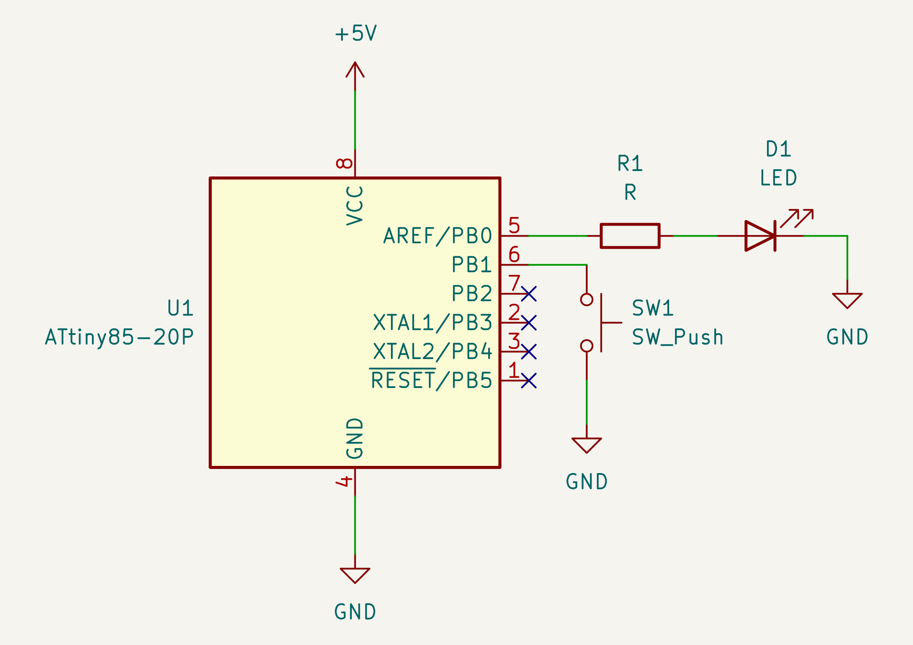

# GPIO

Using GPIO pins (PB0-PB4) requires Memory-mapped Resister Access. To control
resisters, set (or clear) bit(s) on the resister. A typical resister access
looks like:

```c
DDRB |= (1 << DDB0);  // set 1 on 0th bit of DDRB register.
DDRB &= ~(1 << DDB1); // clear 1st bit of DDRB resister.
```

where `DDRB` is the resister, and `DDB0` and `DDB1` is the bit number of
`DDRB`.

It is possible to set multiple bits at the same time.

```c
DDRB |= (1 << DDB0) | (1 << DDB1);  // set 1 on 0th and 1st bit of DDRB register.
```

For simple GPIO operations, there are three resisters:

* `DDRB`, Port B Data Direction Register
* `PORTB`, Port B Data Resister
* `PINB`, Port B Input Pins Address

> ATTiny series MCUs have a single GPIO port, `PORTB`. Other _bigger_ AVR MCUs
> have multiple GPIO ports, such as `PORTA`, `PORTC`, and so on.

`DDRB` configures GPIOs as an input pin or an output pin.

`PORTB` configures the pull-up resistor when the pin is configured as an input,
and drives the pin to HIGH or LOW when the pin is configured as output.

`PINB` keeps logic levels of all GPIO pins. Note that it is not possible to
drive a pin (i.e. `PINB` is read only. Use `PORTB` instead).

## What the program does

`PB0` is an output pin. `PB1` is an input pin.

The program polls the state of `PB1`, and, when `PB1` is LOW, drives PB0
HIGH. When `PB1` is HIGH, it drives `PB0` LOW.

## Requirements

* An ATTiny85
* An LED
* A 1K resistor
* A push button, normally open.

## Schematic



## Homework:

* Change the input pin to `PB2`.
