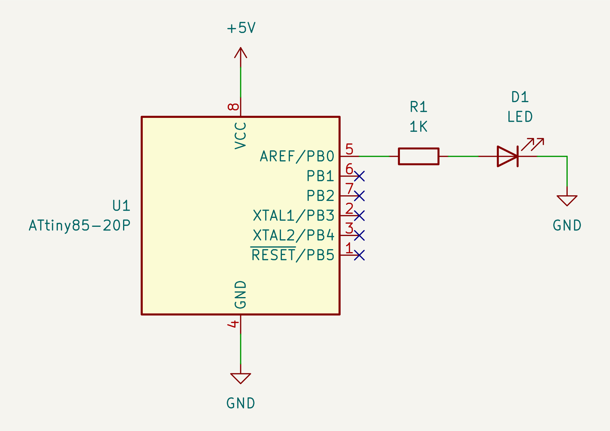

# Fast PWM

Fast PWM is a mode of PWM that AVR MCU supports. Another one is Phase Correct
PWM.

In Fast PWM mode, the `timer0` increases its value by one until the value
reaches to 255. After that the value goes back to 0.

Compare Match occurs when the timer value equals to `OCR0A`. Upon Compare
Match, the output of `PB0` inverts, either HIGH to LOW, or LOW to HIGH,
depending on the configuration.

The duty rate can be changed by setting different value to `OCR0A`.

The clock source of the timer is, by default, the internal system clock, which
is 8MHz with prescaling of 8, or 1MHz.  The frequency can be changed by using
prescaler. As such, you cannot use an arbitrary frequency.

## What the program does

The LED blinks at 3.81Hz with 58.59% duty rate.

## Requirements

* An ATTiny85
* An LED
* A 1K resistor

## Schematic

## Homework:

1. Change the value of OCR0A and see what will happen.
2. Change the prescale factor and see what will happen.
3. Change the output pin to PB1.
