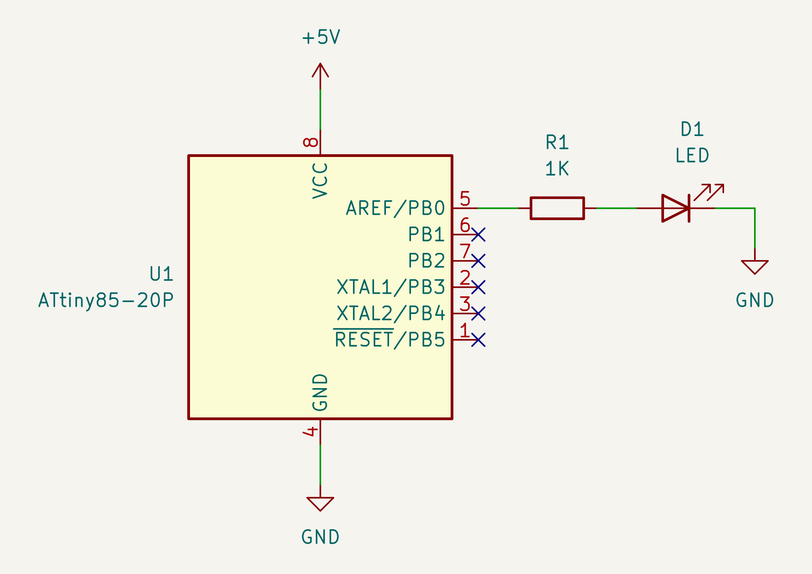

# Phase Correct PWM, or slow PWM

Phase Correct PWM is a mode of PWM that AVR MCU supports. Another one is Fast
PWM.

Unlike Fast PWM mode, the `timer0` increases its value by one until the value
reaches to 255, and decreases it by one until the value reaches to 0 (8 bit
timer). As such, Phase Correct PWM is twice slower than Fast PWM mode.

Compare Match occurs when the timer value equals to `OCR0A`. Upon Compare
Match, the output of `PB0` inverts, either HIGH to LOW, or LOW to HIGH,
depending on the configuration.

The duty rate can be changed by setting different value to `OCR0A`.

The clock source of the timer is, by default, the internal system clock, which
is 8MHz with prescaling of 8, or 1MHz.  The frequency can be changed by using
prescaler. As such, you cannot use an arbitrary frequency.

## What the program does

The LED blinks at 1.91Hz with 58.6% duty rate.

## Requirements

* An ATTiny85
* ["Arduino as ISP" programmer](https://github.com/trombik/kicad-avr-programmer)
* An LED
* A 1K resistor
* 5V power source

## Schematic

.

## Homework:

1. Change the value of OCR0A and see what will happen.
2. Change the prescale factor and see what will happen.
3. Change the output pin to PB1.
